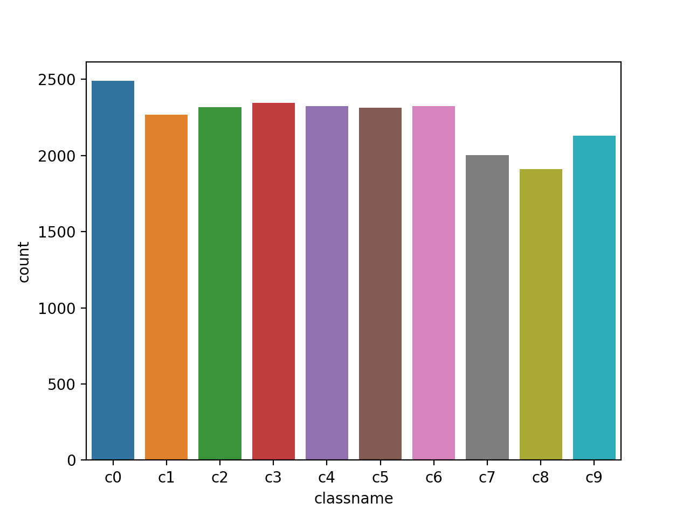
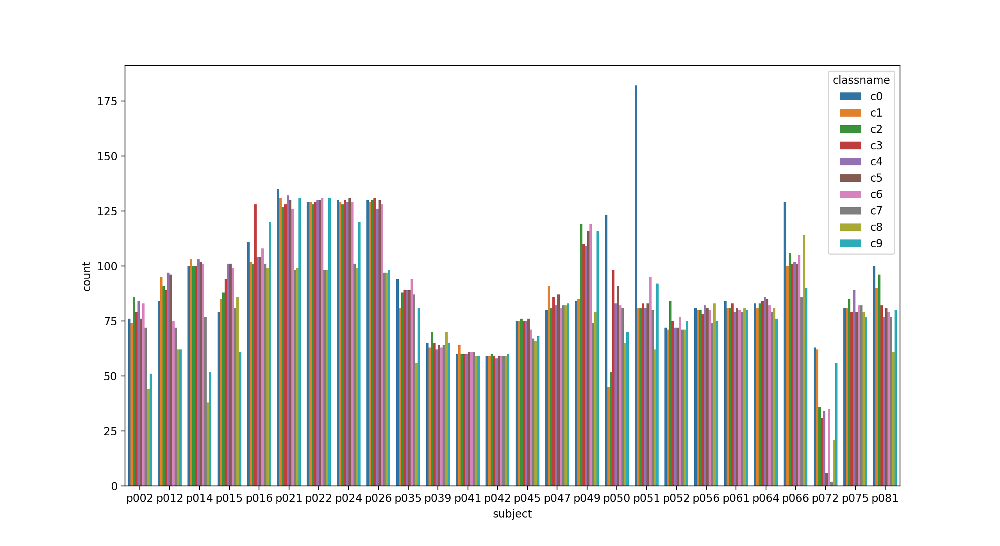
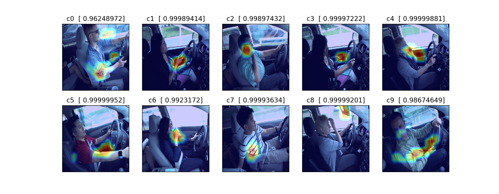

# 使用keras实现走神司机检测
-

环境参考：

* python 3.5
* tensorflow-gpu
* keras
* opencv3

-
#### 数据
数据集来自 kaggle 的一个竞赛：[state-farm-distracted-driver-detection](https://www.kaggle.com/c/state-farm-distracted-driver-detection/data)

下载下来数据后解压缩，imgs文件夹中包含了train、test两个文件夹，而train文件夹中有c0~c9这10个文件夹。
训练集有24000+张图片，26个driver(subject)，10种行为(c0~c9)。测试集有70000+张图片。

训练集数据分布：

可以看出每个类别的图片数量分布在2000~2500这个区间，数据集是平衡的。

每个driver的类别分布情况：一共有26个driver，除了p051、p050、p072的两个类别最大差超过了50之外，其它driver各个类别的数量差距不大，所以可以认为是平衡的。

-

#### 运行 
程序入口是training.h：

* 可以调用 train\_on\_single\_model 方法来单独训练一个模型（kfold=1），也可以进行k折交叉验证（如kfold=8）
	
		train_on_single_model(Pretrained_MODEL=VGG16, freeze_layers_num=15,
                          	  image_size=(224, 224),
                          	  batch_size=128, kfold=8, bf_epoch=100, ft_epoch=35,
                              modelStr='_gap_ver4_',
                              preprocess=vgg16.preprocess_input)

* 利用训练好的模型来预测图片，并可视化其CAM

	    visulization.show_all_classes_cam(Pretrained_model=VGG16,
	                         model_path='VGG16_gap_ver4_ft.fold_0.hdf5',
	                         final_conv_layer_name='block5_conv3',
	                         img_size=(224, 224),
	                         preprocess_input=vgg16.preprocess_input)

	结果如图所示：

参考链接：
[Learning Deep Features for Discriminative Localization](http://cnnlocalization.csail.mit.edu/)

* 模型融合：提取多个预训练模型的bottleneck features，再训练顶层的分类器。具体实现参考 ensemble\_from\_bf()
